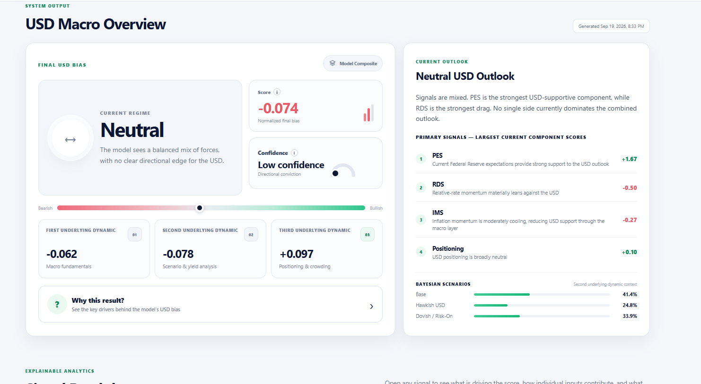

# MacroLens

**MacroLens is a Python-based quantitative analysis system that transforms macroeconomic, rates, positioning and sentiment data into a structured, explainable outlook for the US dollar.**

Created by **Matthew Townsend**.



## Why I built it

Macro analysis often ends as a collection of disconnected charts, releases and opinions. MacroLens was built to turn that workflow into a repeatable software pipeline: collect structured data, normalize signals, combine them into analytical layers, and expose both the final result and the reasons behind it.

The project began as separate Python analysis scripts and evolved into a modular system with a private calculation engine, a stable JSON data contract, deterministic explainability and a public dashboard.

## What the system does

MacroLens combines three analytical layers:

1. **First Underlying Dynamic — Macro Fundamentals**  
   Labour-market, inflation, relative-rate and Federal Reserve policy data are converted into a structured view of the US macro backdrop.

2. **Second Underlying Dynamic — Scenario & Yield Analysis**  
   Yield spreads, carry, real-rate differentials and macro-regime information are used to test the fundamental view and update alternative scenario weights.

3. **Third Underlying Dynamic — Positioning & Market Context**  
   Institutional, retail and hedge-fund positioning are used to assess USD crowding. Risk sentiment is displayed separately as supporting market context.

The final output is a normalized USD bias accompanied by confidence, ranked drivers, source status and plain-English explanations.

## Engineering highlights

- **Python data pipelines** for economic and market data ingestion
- **REST/API integrations** including FRED, CFTC, Yahoo Finance and Myfxbook
- **pandas / NumPy-style statistical processing** and normalized signals
- **JSON data contract** separating private calculation logic from the public frontend
- **Deterministic explainability** generated from model output rather than an LLM
- **Graceful missing-data handling** so unavailable sources do not become fabricated zeroes
- **Source-health reporting** so the dashboard exposes data availability instead of hiding gaps
- **Credential isolation** using environment variables; no API credentials are stored in the public frontend
- **Responsive JavaScript dashboard** built without a frontend framework

## Architecture

```text
Economic + market sources
          |
          v
   Private Python engine
          |
          v
Normalized signals + analytical layers
          |
          v
macrolens_output.json
          |
          v
Public explainable dashboard
```

The public repository intentionally contains the presentation layer and a sanitized model-output contract. The exact scoring implementation and credentials are kept separately.

See [Architecture](docs/ARCHITECTURE.md) and [Methodology](docs/METHODOLOGY.md) for more detail.

## Repository structure

```text
.
├── index.html
├── styles.css
├── app.js
├── data/
│   └── macrolens_output.json
├── assets/
│   └── macrolens-overview.png
└── docs/
    ├── ARCHITECTURE.md
    ├── METHODOLOGY.md
    └── SECURITY.md
```

## Data and transparency

“Live data” means the latest data available to the current model run, not tick-by-tick market data. Some inputs are automated while others are manually verified. The dashboard reports source status so users can see which inputs were available for the current output.

## Current status

**Portfolio release / V1.0.** The project is usable today, while historical validation, additional currencies and further automation remain future work.

## Future work

- historical validation and backtesting
- additional currency models
- automated refresh/deployment pipeline
- stronger test coverage
- richer data provenance and release timestamps

---

**Founder & Developer:** Matthew Townsend  
Personal site: https://matthewtownsend.dev/
